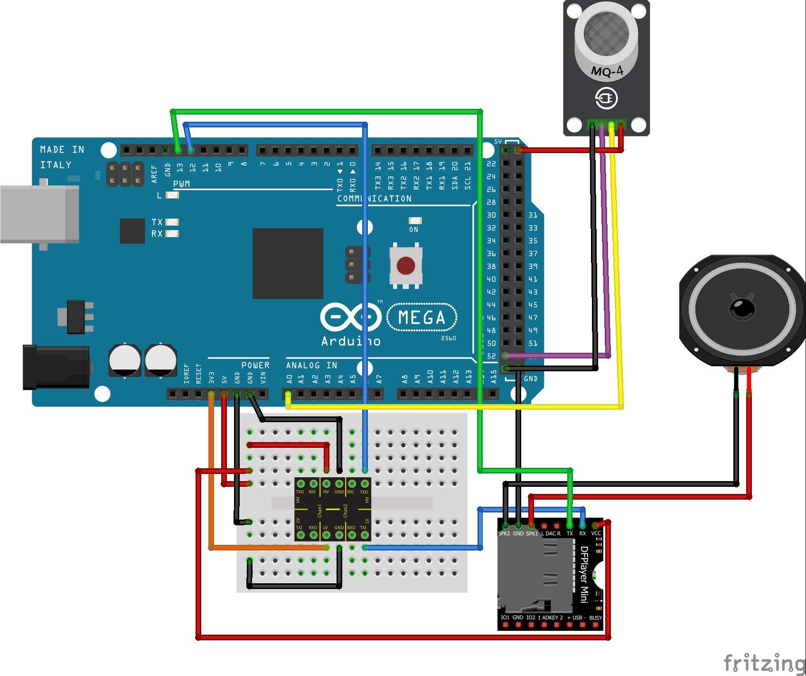

# Alarme
Esta seção trata da verificação da lógica de funcionamento do sistema de alarme contra gases tóxicos e fumaça. Para este bloco são utilizados os componentes, Dfplayer Mini, MQ-2, autofalante e o módulo conversor de nivél lógico RC.

## Esquemático
 

#### Código Alarme

~~~C++
/****************************************************************************************
  Instituto Federal de Educação, Ciência e Tecnologia de Santa Catarina-Campus Florianópolis
  Unidade Curricular: Projeto Integrador II
  Aluno: João Pedro de Araújo Duarte
  Semestre 2021.1

  Objetivo: Verificar o sensor de gás e acionar o som de alerta, caso o sensor de gás ative
****************************************************************************************/

#include "Arduino.h"
#include "SoftwareSerial.h"
#include "DFRobotDFPlayerMini.h" //Biblioteca do Dfplayer Mini
#define ENTRADA_DIGITAL 52
#define ENTRADA_ANALOGICA A0

SoftwareSerial mySoftwareSerial(12, 13); // Descreve as portas para comunicação serial entre o bluetooth e o arduino ordem RX, TX
DFRobotDFPlayerMini myDFPlayer;
bool gas;
int leitura, i;
void setup()
{
  pinMode(ENTRADA_DIGITAL, INPUT);
  Serial.begin(9600);
  mySoftwareSerial.begin(9600);
  som();
  //Definicoes iniciais
  myDFPlayer.setTimeOut(500); //Timeout serial 500ms
  myDFPlayer.EQ(5);
  // Ajusta Volume
  for (i = 1; i <= 10; i++) {
    myDFPlayer.volumeDown();
  }
}
void som() {
  mySoftwareSerial.begin(9600);
    while (!myDFPlayer.begin(mySoftwareSerial)) {
      Serial.println("Aguardando som");

    }
  delay (1000);
}
long tempoAnterior = 0;
void verificacao() { //Função responsável por verificar os valores do sensor de gás e fumaça
  if (millis() >= tempoAnterior + 1000) {
    tempoAnterior = millis();
    gas = digitalRead(ENTRADA_DIGITAL);
    leitura = analogRead(ENTRADA_ANALOGICA);
  }
}
void alarme() { //Aciona o alarme dando play no módulo caso o sensor de gás e fumaça ative
  if (gas == 0) {
    myDFPlayer.start();
  }
  else {
    myDFPlayer.stop();
  }
}

void loop()
{
  verificacao();
  alarme();
}
~~~
#### [PARA BAIXAR O ARQUIVO DE ÁUDIO MP3 DO ALARME CLIQUE AQUI](https://github.com/jaojao7/pi2_jpad/raw/main/Arquivos/alarme1.mp3)

# IMPORTANTE
O módulo de som Dfplayer mini necessita de um cartão microSD formatado em FAT32 para poder tocar o arquivo de áudio do alarme. A entrada de dados RX do módulo deve passar pelo conversor de nível lófico RC como descrito no esquemático acima, para que a comunicação com o arduino ocorra de forma  correta.

 #### [PARA VOLTAR A PÁGINA DOS TESTES CLIQUE AQUI](https://github.com/jaojao7/pi2_jpad/blob/main/testes.md)
