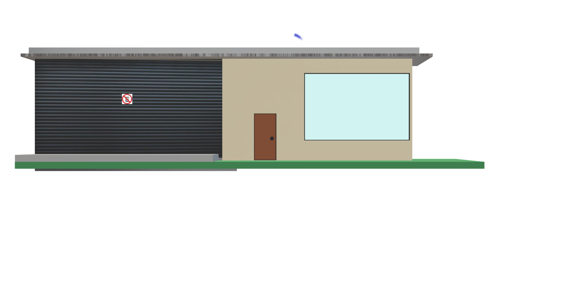
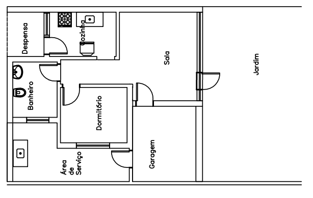
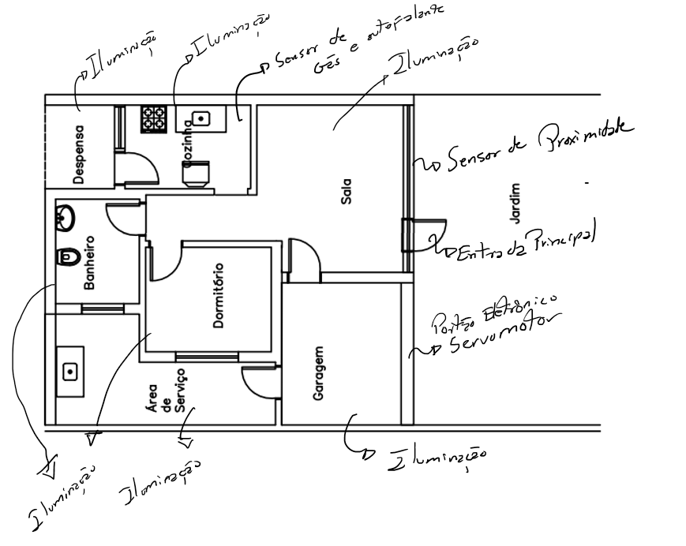

## Objetivo Geral

Temos como principal objetivo deste projeto a construção de uma maquete residencial (Figuras 1 e 2) com o intuito de que sirva como uma base para aplicação 
da dómotica, ou seja, proporcionar a configuração de alguns dos sistemas elétricos e mecânicos da casa maquete para funcionarem conectados a um controle em comum, simulando 
em escala reduzida o funcionamento real.

###### Figura 1 -Modelo desenho 3D casa maquete frontal.

 

###### Figura 2 -Modelo desenho 3D casa maquete. 

 

## Objetivos Específicos 

* Através dos recursos dispostos construir uma casa maquete seguindo o modelo de planta baixa (Figura 3).  
* Implementar todo o sistema elétrico da casa maquete, incluindo sistema de iluminação, ventoinhas e outros dispostivos que se fizerem viáveis e convenientes
na hora da execução do projeto e que atenda os seus requisitos.  
* Conectar sensores e componentes com propósitos pré definidos (Figura 4) em cômodos da casa maquete para fazer o controle dos parâmetros de acordo com a 
necessidade do usuário. 

###### Figura 3 - Planta baixa casa modelo maquete.

 

#### Os requisitos fundamentais do projeto:
 * Controlar a iluminação dos cômodos.

* Utilizar o sensor de presença para o jardim.

* Utilizar o sensor de gás.

* Utilizar o servomotor para o portão eletrônico.

###### Figura 4 - Planta baixa casa maquete com indicação dos sensores.

 
