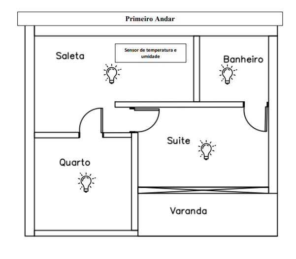

## Objetivo

Temos como principal objetivo deste projeto utilizar os conceitos que envolvem o CDIO (Conceive, Design, Implement and Operate), relacionando-o com sistemas residenciais, mediante o uso de uma maquete como ponto de partida.Para a construção da maquete devemos conceber, projetar, implementar, e por fim operar sistemas de automação residencial, integrando a estrutura elétrica da maquete à Internet das Coisas – IoT.

Abaixo algumas etapas a serem alcançadas:
* Realizar todo o controle da casa remotamente via Bluetooth, utilizando um aplicativo desenvolvido na plataforma MIT App Inventor.
* Através dos recursos dispostos construir uma casa maquete seguindo o modelo de planta baixa (Figuras 1 e 2).  
* Implementar todo o sistema elétrico da casa maquete, incluindo sistema de iluminação, ventoinhas e outros dispostivos que se fizerem viáveis e convenientes
na hora da execução do projeto e que atenda os seus requisitos.  
* Conectar sensores e componentes com propósitos pré definidos (Figuras 1 e 2) em cômodos da casa maquete para fazer o controle dos parâmetros de acordo com a 
necessidade do usuário. 
* Implementar um sistema de alarme sonoro com mensagem em voz, caso o sensor de gás seja acionado.

* Controlar a iluminação dos cômodos.

* Utilizar o sensor de presença para o jardim.

* Utilizar o servomotor para o portão eletrônico.

###### Figura 1 - Planta baixa Térreo casa maquete com indicação dos sensores.

 
###### Figura 2 - Planta baixa Primeiro Andar casa maquete com indicação dos sensores.

 

Formam realizados alguns testes inicias antes de iniciar a implementação do funcionamento final
*  ### [Para acessar a página referente aos testes realizados clique aqui](https://github.com/jaojao7/pi2_jpad/blob/main/testes.md)
