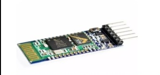

## Design do Projeto

Abaixo segue uma tabela com os componentes utilizados e suas respectivas descrições,  na sequência o esquemático da montagem:

Imagem |Componente   | Quantidade | Descrição/Utilização
:-------:|:---------: | :--------------:| :------ 
 |Led Branco 5mm | 10| Iluminação do projeto
|Resistor 330Ω | 11| Utilizado na parte do alarme e na iluminação do projeto
|Resistor 10kΩ | 1 | Utilizado com o sensor DHT11
|Placa Arduino Mega 2560 R3 |1|Utilizada para o desenvolvimento e funcionamento do projeto
 |MQ-2|1|Sensor de Gás inflamável e de fumaça
|DHT11|1|Sensor de umidade e temperatura 
|PIR|1|Sensor de presença
|Módulo HC-05|1|Módulo Bluetooth
|Conversor de Nível Lógico RC|1|Conversor de Nível Lógico RC Bidirecional
|Modulo wtv020 sd|1|Utilizado na parte do alarme
|PAM8403|1|Amplificador Digital utilizado na parte do alarme 
|Módulo MB102|1| Fonte de tensão ajustável
|Auto falante 0.5W 8Ω|1|Utilizado na parte do alarme
|Servomotor|1|Utilizado no mecanismo de entrada da garagem

###### Figura 1 - Esquemático do Projeto  

### Algumas Observações:

* Para utilização do módulo Bluetooth é necessário o conversor de nível lógico nas entradas RX e TX pois o mesmo trabalha com a tensão de 3.3V e as entradas do Arduino fornecem 5V.
* O amplificador PAM8403 é utilizado para melhoria do som, porém o sistema funcionaria sem o mesmo. Bastando conectar o autofalante diretamente nas entradas correspondentes no wtv020 SD.
* Atenção a tensão de alimentação do módulo wtv020 SD como sendo 3.3V.
* No sensor DHT11 é necessário um resistor de 10kΩ conectado as entradas VCC e de dados do componente.

### Aplicativo
Abaixo algumas imagens do aplicativo que será posteriormente utilizado para realizar o controle da casa:
###### Figura 2 - Tela Incial  

###### Figura 3 - Tela Principal  

###### Figura 4 - Tela Térreo  

###### Figura 5 - Tela Primeiro Andar 

