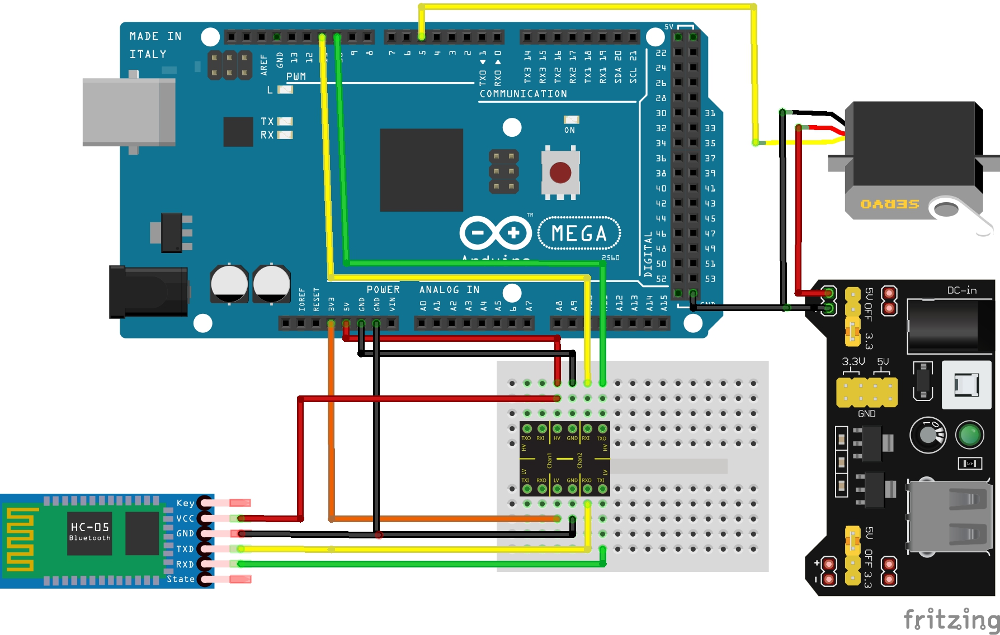

# Teste Garagem

### Garagem (Servomotor)

Para o funcionamento do sistema de garagem o seguinte esquemático foi seguido para verificação do correto funcionamento do componente e se seu desempenho atende ao objetivo esperado.

## Esquemático

##### Código da Garagem

~~~C++
/**********************************************************************************************************
  Instituto Federal de Educação, Ciência e Tecnologia de Santa Catarina-Campus Florianópolis
  Unidade Curricular: Projeto Integrador II
  Aluno: João Pedro de Araújo Duarte
  Semestre 2021.1

  Objetivo: Verificar o funcionamento do sistema de abertura e fechamento da garagem utilizando o servomotor
  com controle do aplicativo
************************************************************************************************************/
#define dados_servo 5
#include "SoftwareSerial.h"
#include <VarSpeedServo.h> // Inclui a biblioteca para servos motores com controle de velocidade da abertura
int incomingByte; // Variável para armazenar o comando recebido pelo aplicativo
VarSpeedServo servo_motor; // Cria um objeto para o controle do servo
SoftwareSerial bluetooth(10, 11);// Descreve as portas para comunicação serial entre o bluetooth e o arduino ordem RX, TX

void setup() {
  Serial.begin(9600);
  servo_motor.attach(dados_servo);  // Informa qual pino será usado para o servo declarado anteriormente
  pinMode(dados_servo, OUTPUT); // configura o pino como saída
  bluetooth.begin(9600); // Inicializa o módulo bluetooth

}
void estado() {
  if (bluetooth.available() > 0) {
    incomingByte = bluetooth.read();
    if (incomingByte == 'G') {
      servo_motor.slowmove(200, 30); //Quando o botão 'fechar' no aplicativo é pressionado o arduino recebe a variável 'G' e executa a tarefa
    }
    else if (incomingByte == 'F') { //Quando o botão 'abrir' no aplicativo é pressionado o arduino recebe a variável 'F' e executa a tarefa
      servo_motor.slowmove(88, 30);
    }
  }
}

void loop() {
  estado();
}
~~~

*  ## [Para voltar a página referente aos testes realizados clique aqui](https://github.com/jaojao7/pi2_jpad/blob/main/testes.md)

