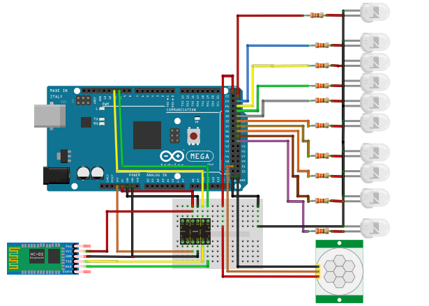

# Iluminação
Esta seção trata da montagem do bloco de iluminação para realização de possíveis testes que se fizerem necessários. Fazem parte deste bloco os componentes de iluminação (LED'S, e sensor PIR) além claro do módulo de comunicação com o aplicativo via Bluetooth.

## Esquemático

#### Código Iluminação
~~~C++
/******************************************************************************************
  Instituto Federal de Educação, Ciência e Tecnologia de Santa Catarina-Campus Florianópolis
  Unidade Curricular: Projeto Integrador II
  Aluno: João Pedro de Araújo Duarte
  Semestre 2021.1

  Objetivo: Verificar o sistema de iluminação, acionamento por presença e por comandos diretos no aplicativo
*******************************************************************************************/
#include "SoftwareSerial.h"
#define sala 30
#define segsala 31
#define banheiro 32
#define cozinha 33
#define garagem 34
#define entrada 35
#define quarto 36
#define suite 37
#define sala2 38
#define banheiro2 39
#define pinPIR 50
int incomingByte;
SoftwareSerial bluetooth(10, 11);

void setup() {
  pinMode(sala, OUTPUT);
  pinMode(segsala, OUTPUT);
  pinMode(banheiro, OUTPUT);
  pinMode(cozinha, OUTPUT);
  pinMode(garagem, OUTPUT);
  pinMode(entrada, OUTPUT);
  pinMode(quarto, OUTPUT);
  pinMode(suite, OUTPUT);
  pinMode(sala2, OUTPUT);
  pinMode(banheiro2, OUTPUT);
  bluetooth.begin(9600);
}
void luzes() { //Função responsável por acionar as luzes caso o arduino receba do aplicativo a variável correspondente
  if (bluetooth.available() > 0) {
    incomingByte = bluetooth.read();
    switch (incomingByte) {
      case 'A':
        digitalWrite(sala, !digitalRead(sala));
        digitalWrite(segsala, !digitalRead(segsala));
        break;
      case 'B':
        digitalWrite(banheiro, !digitalRead(banheiro));
        break;
      case 'C':
        digitalWrite(cozinha, !digitalRead(cozinha));
        break;
      case 'D':
        digitalWrite(garagem, !digitalRead(garagem));
        break;
      case 'H':
        digitalWrite(quarto, !digitalRead(quarto));
        break;
      case 'I':
        digitalWrite(suite, !digitalRead(suite));
        break;
      case 'J':
        digitalWrite(sala2, !digitalRead(sala2));
        break;
      case 'K':
        digitalWrite(banheiro2, !digitalRead(banheiro2));
        break;
    }
  }
}

void presenca() { //Função responsável por verificar se o sensor de presença foi acionado ou não, caso positivo liga o LED da entrada
  bool valorPIR = digitalRead(pinPIR);

  if (valorPIR == HIGH) {
    digitalWrite(entrada, HIGH);
  }
  else if (valorPIR == LOW) {
    digitalWrite(entrada, LOW);
  }
}

void loop() {
  luzes();
  presenca();
}
~~~
# IMPORTANTE
É necessário atenção, pois as conexões dos LED's descritas no código acima podem diferir do esquemático, mas, é importante ressaltar que o esquemático é apenas uma ilustração indicativa. Caso for realizar a montagem desta seção, basta ajustar o código de acordo com a sua condição de montagem. O esquemático demonstra em que categoria de pinos cada componente deverá ser conectado. A exemplo os próprios LED's, onde o ânodo devem ser conectado as entradas digitais e o cátodo no GND.

 #### [PARA VOLTAR A PÁGINA DOS TESTES CLIQUE AQUI](https://github.com/jaojao7/pi2_jpad/blob/main/testes.md)
