# IMPLEMENTAÇÃO
Nesta etapa iremos de fato iniciar a montagem do projeto de automatização residencial aplicado a uma maquete, a mesma irá receber essas tecnologias baseando-se na estrutura apresentada e projetada na etapa do design. A implementação foi realizada seguindo a mesma ordem de apresentação desta página. Primeiro a montagem da estrutura da maquete, seguida pela instalação dos sensores, cabos, LED's e outros componentes elétricos e por fim, o teste das conexões e estururas por meio da aplicação de controle.

## MAQUETE
  Para a fabricação da maquete, foi utilizado uma maquete modelo sobrado já cortada em MDF, devidamente montada e pintada para posteriormente receber toda a parte eletroeletrônica do projeto, a seguir as medidas da maquete e fotos ilustrativas da montagem:
#### Figura 1 Medidas Maquete 1

#### Figura 2 Medidas Maquete 2

#### Figura 3 Montagem 1
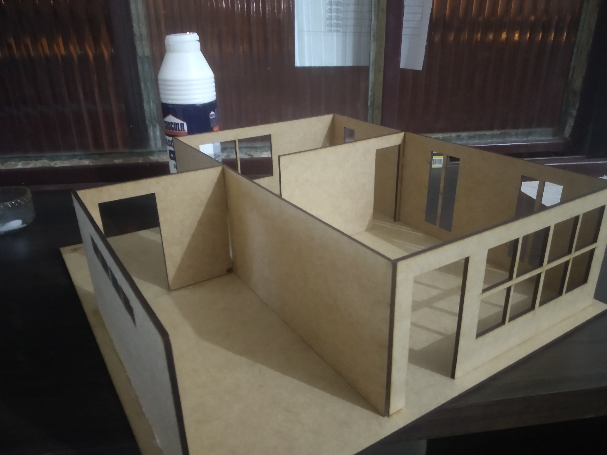

#### Figura 4 Montagem 2
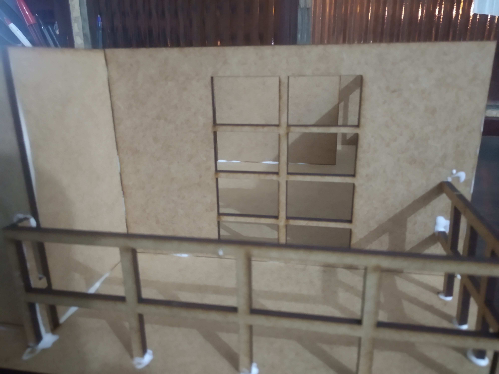

#### Figura 5 Montagem 3
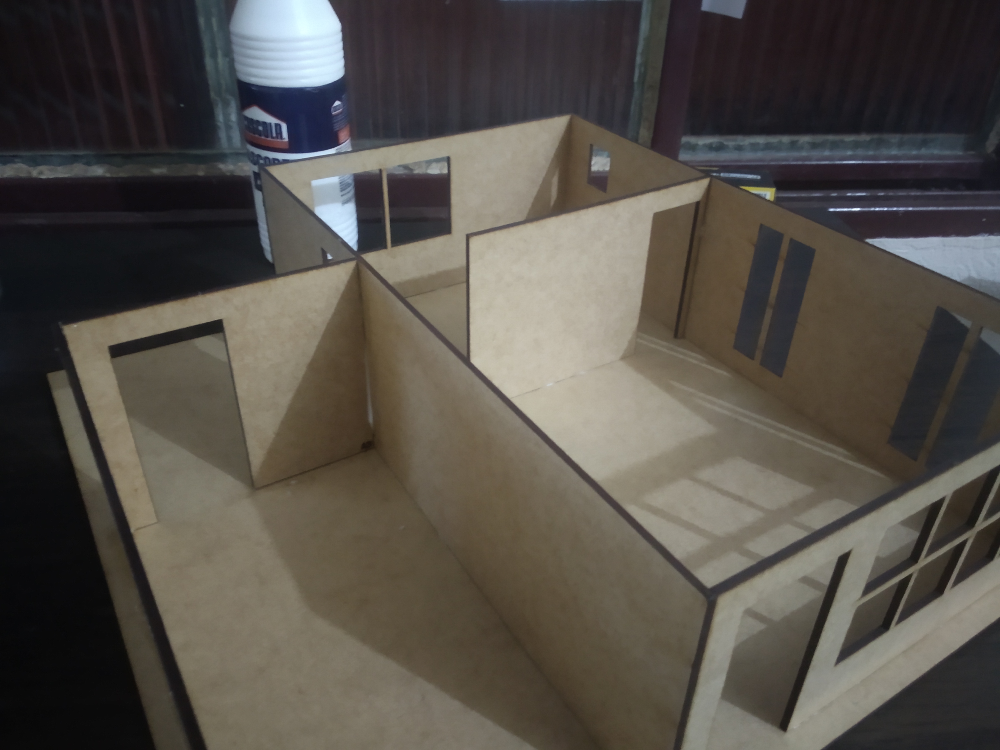

#### Figura 6 Montagem Concluída 
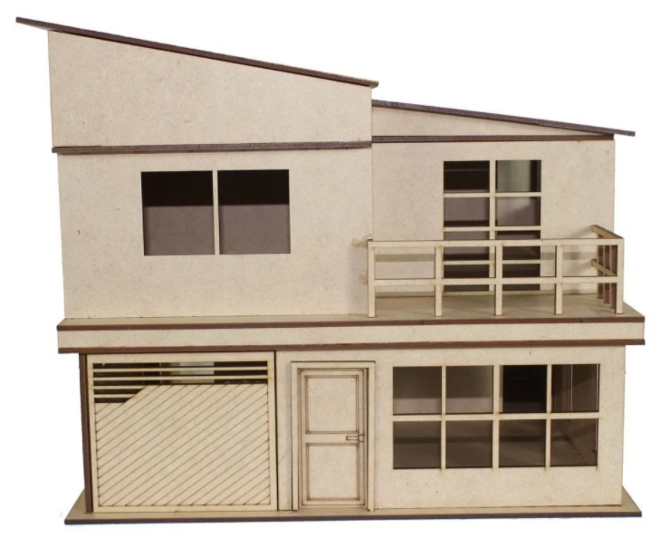

#### Figura 7 Pintura
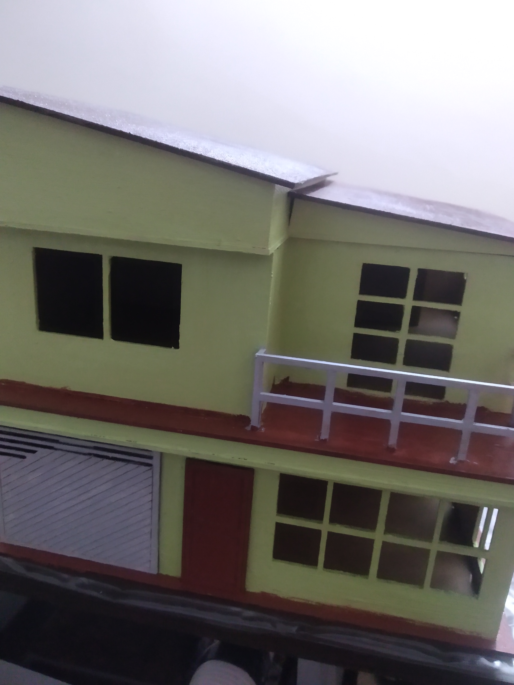

#### Figura 8 Pintura Finalizada
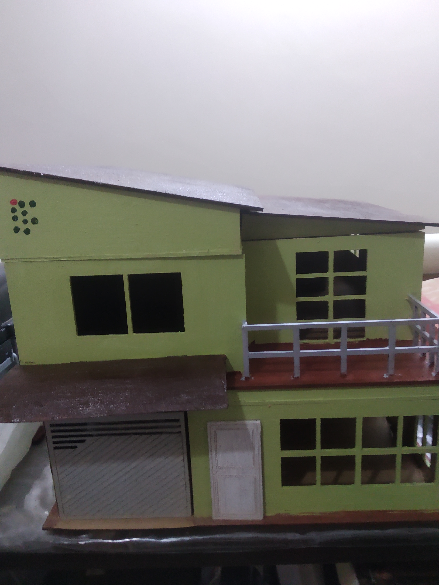

## IMPLEMENTAÇÃO DOS CIRCUITOS A MAQUETE
Primeiro os LED's foram soldados aos resistores e colados nos devidos locais destinados, na laje da maquete:
#### Figura 9 Colocação dos LED's 

#### Figura 10 Colagem dos LED's

Após isso foi realizada a conexão dos LED's nos fios:

#### Figura 11 Conexão LED's

#### Figura 12 Passagem dos fios para o andar de cima 

Em seguida, foram instalados o servomotor e o sensor de gases :

#### Figura 13 Servo motor 
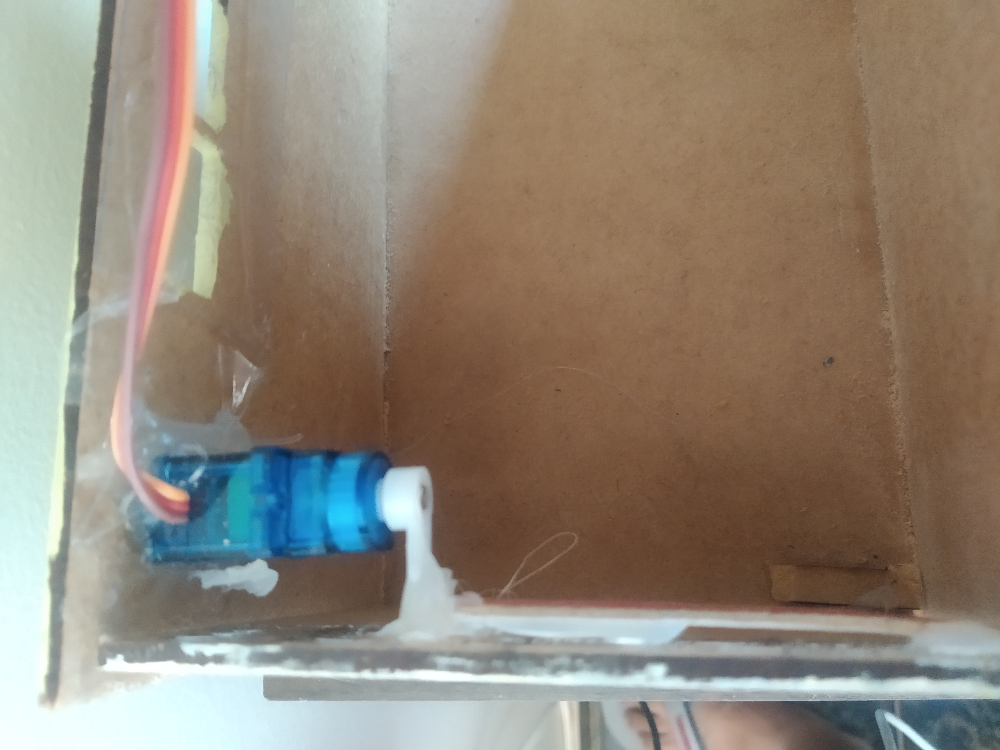

#### Figura 14 Sensor de gases e fumaça

E por fim foi feita todas as conexões dos sensores e LED's:

#### Figura 15 Conexões Gerais

E realizado testes da montagem para verificação dos resultados
#### Figura 16 Teste geral - Iluminação
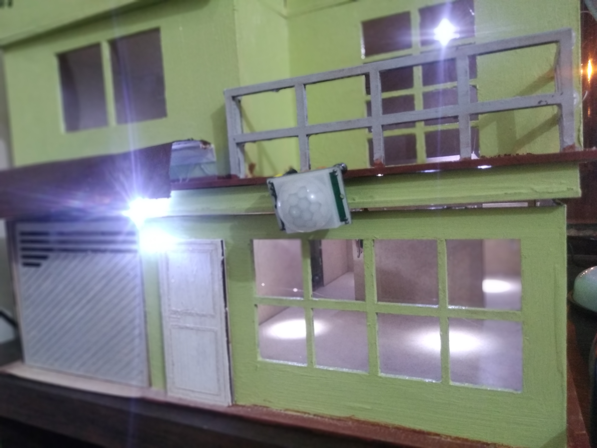

#### Figura 17 Teste geral - Garagem e entrada
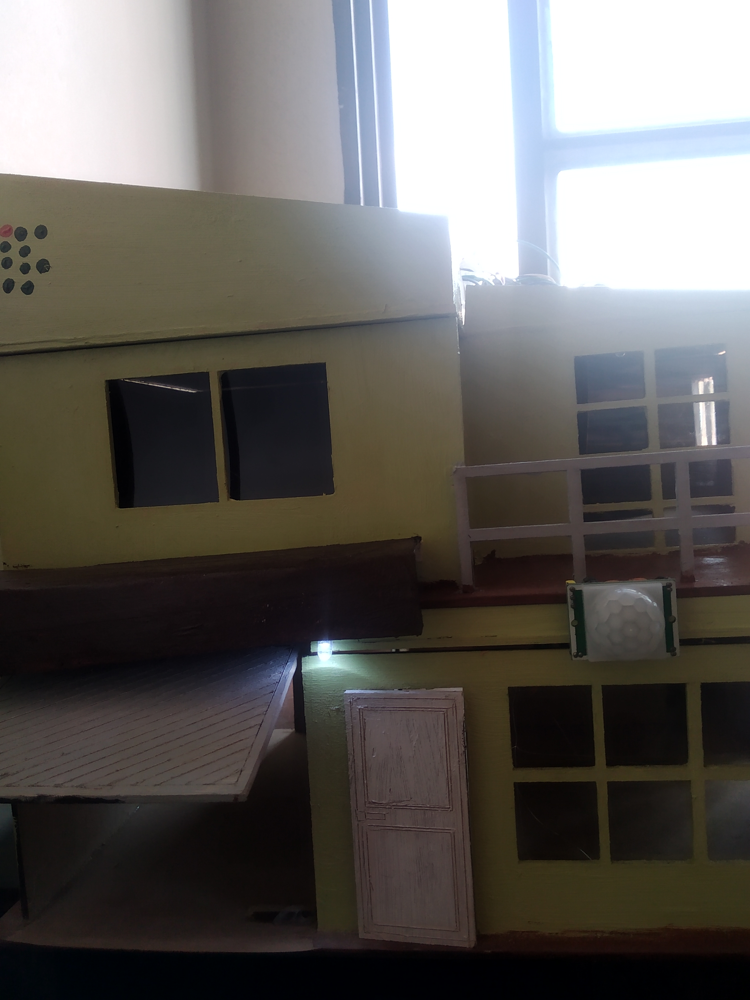

## CÓDIGO PRINCIPAL
### [PARA ACESSAR O CÓDIGO CLIQUE AQUI](https://github.com/jaojao7/pi2_jpad/blob/main/Arquivos/Projeto_Final.ino)

## FUNCIONAMENTO DO CÓDIGO

Abaixo foi montado um fluxograma para melhor compreensão e explicação do fluxo principal de funcionamento:

Podemos dividir o fluxograma de funcionamento acima em duas partes principais, a formada pelas tarefas dentro dos retângulos logo após a inicialização, onde os mesmos representam a função setup, que é a primeira a ser executada pelo Arduino. Outra região repesentada pelas tarefas dentro das elipses correspondem a execução da função loop do Arduino.

### Função Setup
A função setup conforme visto na representação acima, executa uma série de comandos para inicializar a comunicação com os módulos e sensores, além disso, já realiza a tarefa de verificação do módulo de som e a execução da dimuição do volume do mesmo. Ela é executada somente uma única vez.

### Função Loop
  
A função loop é responsável por chamar diversas outras funções que são as responsáveis para a execução do conjunto de tarefas do sistema. Para melhor explicação, essa parte da execução do código foi divida em quatro etapas que são executadas de forma conjunta e serão melhores trabalhadas nos tópicos abaixo:

* 1 - Responsável por medir a temperatura e umidade, esse bloco funciona da seguinte maneira: Primeiro ele mede a temperatura e umidade, armazenas os valores lidos em variáveis distintas, aguarda 1 segundo e envia as informações armazenadas para o módulo Bluetooth, onde é posteriormente enviado ao celular. O tempo total de execução desse bloco é de 3 segundos.
* 2- Responsável por acionar a luz de entrada conforme a detecção de presença é verificada. O programa verifica constantemente se o sensor de presença é ativado. Caso positivo, ocorre a execução da tarefa responsável por acionar a luz de entrada. Caso negativo, ele volta a verificar se o sensor passa a ser ativado. Esse bloco possui uma temporização independente.
* 3-Responsável pelo sistema do alarme. O programa realiza uma leitura a cada 1 segundo dos valores de concentração de gases e fumaça que o sensor MQ-2 envia. Caso o valor atinga uma quantidade significativa, o sensor é acionado e então ocorre a execução do comando para dar play no alarme no sistema de som. Caso negativo, ele aguarda 1 segundo e realiza uma nova leitura.
* 4-Responsável por realizar os comando do Bluetooth. Esse bloco funciona verificando continuamente se houve o recebimento de algum dado vindo do módulo Bluetooth,caso positivo o programa executa o comando referente a informação recebida. Caso negativo, o programa volta a verificar continuamente se há algum recebimento de dado. Esse bloco também possui uma temporização independente.

É importante ressaltar que, após a execução das tarefas referentes dentro da função loop, a mesma retorna ao estado de leitura inicial completando o ciclo. Isso é indicado pela seta em azul, demonstrando o retorno da função após sua execução. Novamente reafirmo que as funções tarefas dentro da função loop são executadas de maneira conjunta, não havendo interdependência de um bloco para outro. 
## APLICATIVO PARA CONTROLE 
A parte de controle da casa será realizada via aplicativo desenvolvido unicamente para este objetivo. Abaixo temos uma explicação da utilização deste APP e uma breve explicação da sua lógica de funcionamento.
 Após a sua inicialização, a tela abaixo será apresentada. Nesta etapa é necessário realizar o login para entrar no aplicativo. Por padrão o login é: 
 Usuário: IFSC
 Senha: pi2

Caso a senha e\ou usuário digitados não correspondam o aplicativo informará o erro e não permitirá o acesso as outras páginas.

#### Figura 18 Tela de login 

Uma vez verificado as credenciais acima, a página principal abaixo é então aberta. Nesta etapa você terá três opções: Voltar a tela de login, iniciar a tela de controle da casa ou iniciar a tela para verificação das condções climáticas.

#### Figura 19 Tela principal

Caso opte por abrir a tela "CASA" referente ao controle dos parâmetros da residência, a tela da figura 20 será aberta.

#### Figura 20 Tela CASA
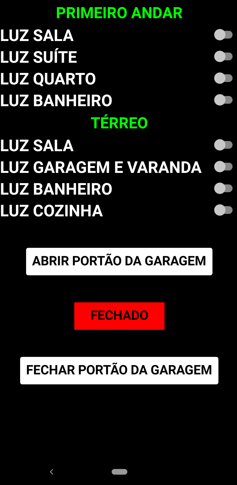

  Algumas informações importantes sobre essa página. O aplicativo já está configurado para iniciar a conexão com o módulo Bluetooth automaticamente pelo endereço do mesmo. São realizados automaticamente duas tentativas de conexão. Caso o aplicativo não consiga realizar essa conexão uma notificação de erro é apresentada ao usuário. Caso consiga conectar, o símbolo Bluetooth fica disponível inidicando o sucesso da conexão.
  Uma vez conectado é possível então realizar o controle da garagem e da iluminação dos comôdos. Quando algum botão de comando é apertado, o aplicativo envia um caracter específico para o arduino, o arduino identifica o comando relacionado ao caracter recebido e executa a tarefa correspondente. 
  
  Caso opte por abrir a tela "TEMPO", a página referente a figura 21 é apresentada. Nesta tela também já estão configurados duas tentantivas de conexão com o módulo Bluetooth automaticamente. Uma vez conectado, o termômetro é iniciado e os valores referentes a temperatura em Celsius e a umidade relativa do ar são apresentados e atualizados a cada 3 segundos.

#### Figura 21 Tela TEMPO
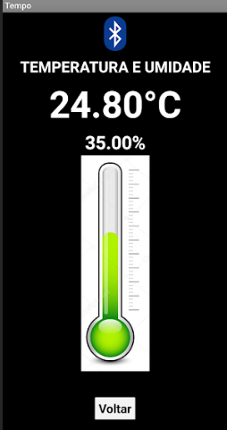

#### [PARA BAIXAR O APK DO APLICATIVO CLIQUE AQUI](https://github.com/jaojao7/pi2_jpad/raw/main/Arquivos/JPAD_automacao.apk)
(Após baixado, basta clicar no arquivo e instalar o mesmo normalmente em seu dispositivo Android)

[PARA VOLTAR AO INÍCIO CLIQUE AQUI](https://github.com/jaojao7/pi2_jpad)
