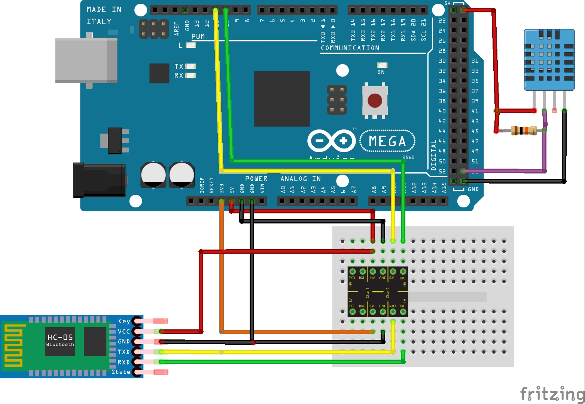

# Tempo

Esta seção trata do bloco responsável por medir e informar a temperatura e umidade. Utilizamos  a configuração demonstrada abaixo, onde temos o sensor DHT11 responsável pelas leituras, e o bloco de comuniacação Bluetooth que envia as informações lidas para o aplicativo.

## Esquemático

##### Código Temperatura
~~~C++
/******************************************************************************************
  Instituto Federal de Educação, Ciência e Tecnologia de Santa Catarina-Campus Florianópolis
  Unidade Curricular: Projeto Integrador II
  Aluno: João Pedro de Araújo Duarte
  Semestre 2021.1

  Objetivo: Verificar a temperatura e umidade no aplicativo do celular via Bluetooth
*******************************************************************************************/
#include "SoftwareSerial.h"
#include "DHT.h"
#define DHTPIN 53
#define DHTTYPE DHT11
DHT dht(DHTPIN, DHTTYPE);
SoftwareSerial bluetooth(10, 11);// Descreve as portas para comunicação serial entre o bluetooth e o arduino ordem RX, TX
float t, h, f; //Define as variáveis para armazenar os valores lidos pelo sensor
void setup() {
  Serial.begin(9600); //Inicializa a serial
  dht.begin(); //Inicializa o módulo DHT11
  bluetooth.begin(9600); //Inicializa o módulo bluetooth
}

long tempoAnterior = 0, tempoAnterior1 = 0; //  Variáveis para definir o controle do intervalo de operação de cada função

void funcionamento() {
  if (millis() >= tempoAnterior + 1000) { //Define que a leitura da variáveis acontece a cada 1000 milisegundos
    tempoAnterior = millis(); //Responsável por zerar a diferença entre o tempo millis e condição tempoAnterior+500
    h = dht.readHumidity();
    t = dht.readTemperature();
    f = dht.readTemperature(true);
    if (isnan(h) || isnan(t) || isnan(f)) {
      Serial.println("Falha na leitura do sensor DHT!");
    }
  }
}
void mostra () { //Função responsável por imprimir a leitura do sensor no monitor serial e também envia-lo ao aplicativo já previamente conectado
  if (millis() >= tempoAnterior1 + 2000) {
    tempoAnterior1 = millis();
    bluetooth.print("TEMP|");
    bluetooth.print(t);
    bluetooth.print("|UMID|");
    bluetooth.print(h);
    Serial.print("|");
    Serial.print("1|");
    Serial.print(t);
    Serial.print("|2|");
    Serial.print(h);
  }
}
void loop() {
  funcionamento();
  mostra();

}
~~~
# IMPORTANTE
É importante ressaltar a utilização de um resistor de 10KΩ entre a entrada VCC e de DADOS do DHT11. Antes de abrir as informações de leitura no aplicativo é sugerido que verifique as medidas no monitor serial do IDE Arduino, para conferir se estão de acordo com o esperado. O aplicativo fornece quatro imagens de termômetro que indicam intervalos de temperatura distintos. 

## Informações adicionais acerca do aplicativo

O aplicativo fornece quatro imagens descritivas no termômetro para indicar intervalos de temperatura distintos, como mostra as imagens abaixo:
#### Temperaturas menores de 15ºC

#### Temperaturas dentro do intervalo de [15ºC - 25ºC]

#### Temperaturas dentro do intervalo de (25ºC - 35ºC]

#### Temperaturas maiores de 35ºC  

 #### [PARA VOLTAR A PÁGINA DOS TESTES CLIQUE AQUI](https://github.com/jaojao7/pi2_jpad/blob/main/testes.md)
