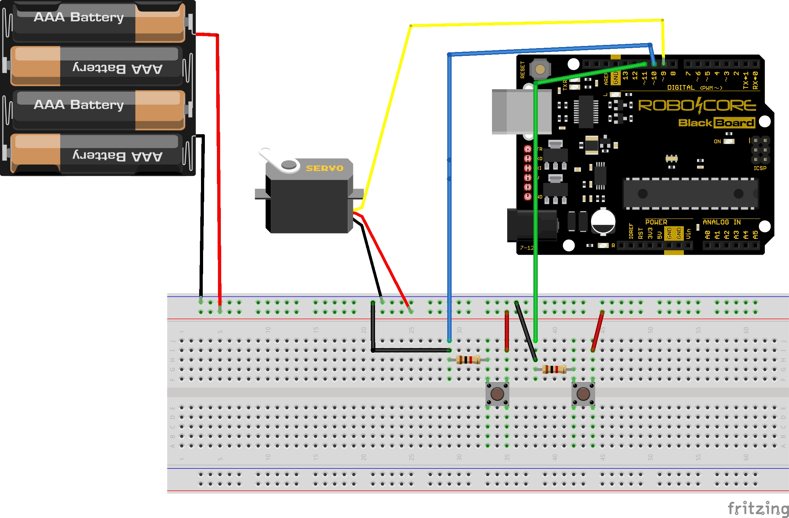

# Testes

Está página trata da simulação e testes realizados individualmente das lógicas de funcionamento e da utilização dos sensores.

### Garagem (Servomotor)

Para o funcionamento do sistema de garagem o seguinte esquemático foi seguido para verificação do correto funcionamento do componente e se seu desempenho atende ao objetivo esperado.

#### Figura 1 Esquemático

#### Figura 2 Código Garagem

~~~C++
#include <Servo.h> // Inclui a biblioteca para servos motores

const int pot = A5; 
int leitura;

Servo servo_motor;  // Cria um objeto para o controle do servo

void setup() {
  pinMode(pot,INPUT);
  servo_motor.attach(9);  // Informa qual pino será usado para o servo declarado anteriormente
 pinMode(10, INPUT);//configura o pino com o botão como entrada
 pinMode(11,INPUT);// configura o pino com o botão como entrada
  pinMode(9, OUTPUT); // configura o pino como saída
}

void loop(){
  switch (digitalRead(11)){// se botão estiver pressionado (HIGH)
    case HIGH:
    servo_motor.write(200);  // Fecha o portão
  break;
  }
 switch (digitalRead(10)){// se botão estiver pressionado (HIGH)
    case HIGH:
    servo_motor.write(88); //Abre o portão
  break;

   }

}
~~~
